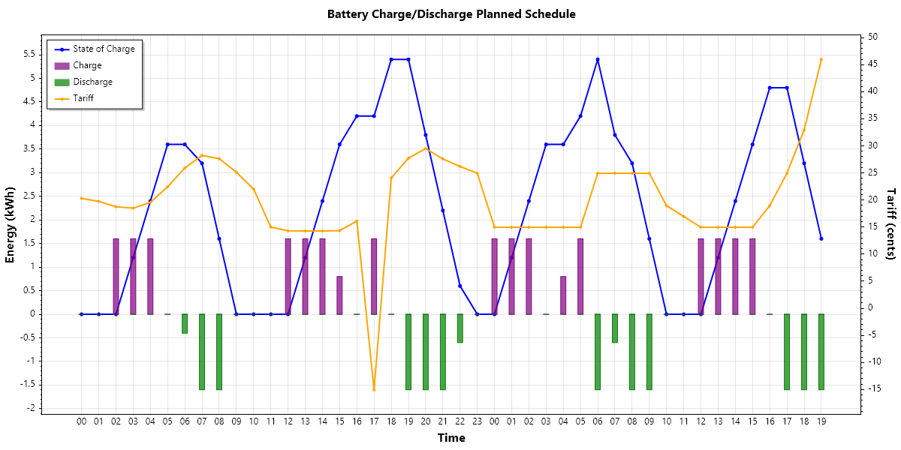

# Homewizard Charge Optimizer with Zonneplan Integration

**Homewizard Charge Optimizer** automates Homewizard battery charging based on Zonneplan's dynamic electricity tariffs.  
It fetches daily tariffs from Zonneplan, analyzes them, and schedules battery charging for the cheapest hours.  
The goal: maximize savings and efficiency by charging when electricity is cheapest (or negative).  
Runs autonomously on a Raspberry Pi for always-optimized battery charging.



This project is a .NET 9 application that integrates with Homewizard batteries and Zonneplan's API to manage battery charging intelligently.  
It is designed for C# developers who want a customizable, open-source alternative to Home Assistant.

The applications uses linear programming (https://developers.google.com/optimization/lp) to optimize battery charging schedules based on electricity prices, battery capacity, and SoC.
Every 5 minutes (configurable) it polls the Homewizard P1 meter for current consumption/production data and battery status and recalculates the optimal charging schedule.

**I cannot guarantee that this application will work for you. Use at your own risk. I am not responsible for any damage or issues caused by using this application.**

---

## Features

- Automatic retrieval of Zonneplan dynamic tariffs
- Smart scheduling for Homewizard battery charging
- Support for multiple Homewizard batteries (only tested with one battery, since I only have one)
- Configurable thresholds and parameters
- Runs as a background service on for example a Raspberry Pi
- Automatic restart on reboot when configured as a service

---

## Known Limitations
- Homewizard currently does not support a discharge only mode. The battery will always charge when there is excess production when in zero mode.
  - As soon as Homewizard supports a discharge only mode, this application will be updated to support that since that will be more cost-efficient.

## Installation Guide

### 1. Prerequisites

- Raspberry Pi (any model, running Raspberry Pi OS or similar)
- .NET 9 SDK and Runtime
- Homewizard battery and P1 meter
- Zonneplan account with API access

---

### 2. Install .NET 9 on Raspberry Pi

1. **Update your system:**
   ```bash
   sudo apt update
   sudo apt upgrade
   ```

2. **Download and install .NET 9 SDK and Runtime:**
    - Go to [https://dotnet.microsoft.com/en-us/download/dotnet/9.0](https://dotnet.microsoft.com/en-us/download/dotnet/9.0)
    - Download the ARM32 or ARM64 binaries for your Pi.
    - Example:
      ```bash
      wget https://download.visualstudio.microsoft.com/download/pr/your-dotnet9-arm.tar.gz
      mkdir -p $HOME/dotnet
      tar -xzf your-dotnet9-arm.tar.gz -C $HOME/dotnet
      ```
    - Add to your PATH (add to `.bashrc` for persistence):
      ```bash
      export DOTNET_ROOT=$HOME/dotnet
      export PATH=$PATH:$HOME/dotnet
      ```

3. **Verify installation:**
   ```bash
   dotnet --version
   ```

---

### 3. Deploy Homewizard Battery Optimizer

1. **Clone or copy the repository to your Pi:**
   ```bash
   git clone https://github.com/fijsh/hw-charge-optimizer.git
   cd HWChargeOptimizer
   ```

2. **Publish the app:**
   ```bash
   dotnet publish -c Release -r linux-arm --self-contained false -o ./publish
   ```

3. **Copy your configuration file (`appsettings.json`) to the `publish` directory.**

---

### 4. Creating tokens

For creating tokens for the P1 meter and Homewizard batteries, consult the Homewizard documentation:
https://api-documentation.homewizard.com/docs/v2/authorization

For creating tokens for Zonneplan, follow the following steps. It is the easiest to use a tool like **[Postman](https://www.postman.com/)** for this.

1) Login

```http
   POST https://app-api.zonneplan.nl/auth/request   
   Content-Type: application/json;charset=utf-8
   
   {
      "email": "YOUR ZONNEPLAN EMAIL",
   }
```

The response will look like this:

```json
{
  "data": {
    "uuid": "123abcde-a123-1a2b-123f-12345ab12345",
    "email": "YOUR ZONNEPLAN EMAIL",
    "is_activated": false,
    "expires_at": "timestamp"
  }
}
```

**Now go to your e-mail and Approve the login request via the e-mail Zonneplan has sent you. After this you can continue with the next step.**

Copy the `uuid` from the response, you will need it in the next step.

2) Get temporary password

Use the `uuid` from the previous step to request a temporary password:

```http
   GET https://app-api.zonneplan.nl/auth/request/123abcde-a123-1a2b-123f-12345ab12345 
```

The response will look like this:

```json
{
  "data": {
    "uuid": "123abcde-a123-1a2b-123f-12345ab12345",
    "email": "YOUR ZONNEPLAN EMAIL",
    "password": "YOUR_TEMPORARY_PASSWORD",
    "is_activated": true,
    "expires_at": "timestamp"
  }
}
```

You will need the `password` from the response in the next step.

3) Request a new access and refresh token

```http
    POST https://app-api.zonneplan.nl/oauth/token    
    Content-Type: application/json

    {
        "grant_type": "one_time_password",
        "email": "YOUR ZONNEPLAN EMAIL",
        "password": "YOUR_TEMPORARY_PASSWORD"
    }
```

The response will look like this:

```json
{
  "token_type": "Bearer",
  "expires_in": 28800,
  "access_token": "YOUR_ACCESS_TOKEN",
  "refresh_token": "YOUR_REFRESH_TOKEN"
}
```

Use the `access_token` and `refresh_token` in your configuration file. The application will handle token refresh automatically from now on.

### 5. Configure the Application

Edit the configuration file (`appsettings.json`) in the `publish` directory.

#### Example Configuration (`appsettings.json`)

```json
{
  "HWChargeOptimizer": {
    "Homewizard": {
      "RefreshIntervalMinutes": 5,
      "P1": {
        "Ip": "ip address of your p1 meter",
        "Username": "your-p1-username",
        "Token": "your-p1-token",
        "BatteryMode": "standby",
        "PowerW": 0,
        "MaxConsumptionW": 0,
        "MaxProductionW": 0,
        "TargetPowerW": 0,
        "LastUpdated": null
      },
      "Batteries": [
        {
          "Name": "Battery 1",
          "Username": "your-battery-username",
          "Ip": "ip address of your battery",
          "Token": "your-battery-token",
          "CapacityKWh": 2.7
        }
      ],
      "MaxChargeRateKWh": 0.8,
      "MaxDischargeRateKWh": 0.8,
      "ChargingEfficiency": 0.8,
      "DischargingEfficiency": 1
    },
    "Zonneplan": {
      "RefreshIntervalMinutes": 60,
      "Authentication": {
        "BaseUri": "https://api.zonneplan.nl",
        "Username": "your-zonneplan-username",
        "AccessToken": "your access token",
        "RefreshToken": "your refresh token",
        "LastUpdated": null,
        "ExpiresIn": 0
      },
      "Tariffs": []
    }
  }
}
```

#### Configuration Settings Explained

- **Homewizard**
    - `RefreshIntervalMinutes`: How often (in minutes) to poll the Homewizard battery and P1 meter. Recommended: 5 minutes.
    - `P1`: Homewizard P1 meter settings.
        - `Ip`: IP address of your P1 meter.
        - `Username`: Username for the P1 meter (friendly name for reference only).
        - `Token`: Authentication token for the P1 meter.
        - `BatteryMode`: Current battery mode (`zero`, `to_full`, `standby`). (auto-managed)
        - `PowerW`, `MaxConsumptionW`, `MaxProductionW`, `TargetPowerW`: Internal state. (auto-managed).
        - `MaxConsumptionW`: Max consumption in watts. retrieved from P1 meter (auto-managed).
        - `MaxProductionW`: Max production in watts. retrieved from P1 meter. (auto-managed),
        - `TargetPowerW`: Target power in watts. retrieved from P1 meter. (auto-managed),
        - `LastUpdated`: Last update timestamp (auto-managed).
    - `Batteries`: List of Homewizard batteries to control.
        - `Name`: Friendly name.
        - `Username`: Username for the battery (for reference only).
        - `Ip`: IP address of the battery.
        - `Token`: Authentication token for the battery.
        - `CapacityKWh`: Battery capacity in kWh.
    - `MaxChargeRateKWh`: Maximum charge rate in kWh. Set according to your battery specs.
    - `MaxDischargeRateKWh`: Maximum discharge rate in kWh. Set according to your battery specs.
    - `ChargingEfficiency`: Charging efficiency (0-1). Set according to your battery specs.
    - `DischargingEfficiency`: Discharging efficiency (0-1). Set according to your battery specs.
- **Zonneplan**
    - `RefreshIntervalMinutes`: How often (in minutes) to fetch new tariffs from Zonneplan. Don't set too low to avoid hitting API limits. Recommended: 60 minutes.
    - `Authentication`: Zonneplan API credentials.
        - `BaseUri`: Zonneplan API base URL.
        - `Username`: Your Zonneplan account username.
        - `AccessToken`, `RefreshToken`, `LastUpdated`, `ExpiresIn`: Managed by the app after first configuration.
    - `Tariffs`: List of tariffs (auto-managed).

---

### 6. Run as a Service (Systemd)

To run the app in the background and restart on reboot:

1. **Create a systemd service file (example for `DietPi`):**

   ```bash
   sudo nano /etc/systemd/system/hwco.service
   ```

   Paste the following (adjust paths as needed):

   ```
    [Unit]
    Description=Homewizard Charge Optimizer for dynamic tariffs
    After=network.target
    
    [Service]
    WorkingDirectory=/usr/local/bin/hwco
    ExecStart=/home/dietpi/.dotnet/dotnet /usr/local/bin/hwco/hwco.dll
    Restart=on-failure
    User=dietpi
    Environment=DOTNET_ROOT=/home/dietpi/.dotnet
    Environment=PATH=/home/dietpi/.dotnet:/usr/local/bin:/usr/bin:/bin
    
    [Install]
    WantedBy=multi-user.target

   ```

2. **Enable and start the service:**

   ```bash
   sudo systemctl daemon-reload
   sudo systemctl enable hwco
   sudo systemctl start hwco
   ```

3. **Check status and logs:**

   ```bash
   sudo systemctl status hwco
   tail -f /usr/local/bin/hwco/logs/app[date].log
   ```

---

## Updating the Application

1. Stop the service:
   ```bash
   sudo systemctl stop hwco
   ```
2. Copy new files or re-publish.
3. Start the service:
   ```bash
   sudo systemctl start hwco
   ```

---

## Troubleshooting

The application uses Serilog for logging. If you encounter issues:

- **Check logs** with `tail -f /usr/local/bin/hwco/logs/app[date].log` for errors.
- Ensure your configuration file is correct and tokens are valid.
- Verify network connectivity to Homewizard and Zonneplan endpoints.
- You must create a local user/token for the P1 meter and each Homewizard battery.

---

## Contributing

Feel free to submit pull requests! For issues, use the GitHub issue tracker.
If you fork the project, it is nice to add a reference to the original repository and author.
---

## License

```markdown
Licensed under the Creative Commons Attribution-NonCommercial (CC BY-NC) license.

Commercial use is not allowed without prior permission from the author.
```

---

